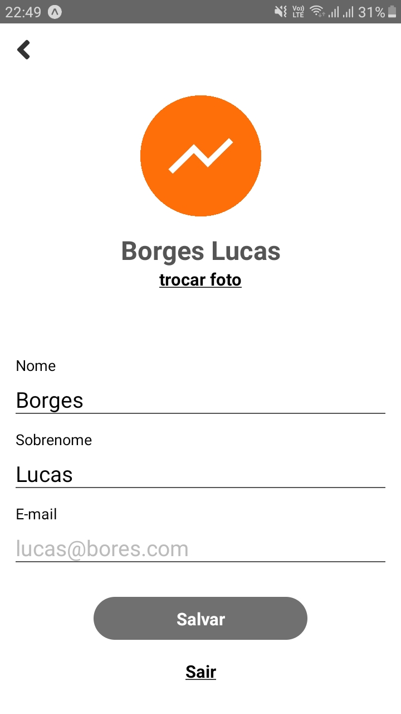

## Supermercado Now App Teste
<br />

# Desenvolva um aplicativo com as seguintes características
1) App Mobile React Native contendo:
- Login;
- Cadastro simples;
- Tela de lista logada;
- Tela de detalhe de perfil - semelhante a tela de Cadastro simples;
<br /><br />

## Instruções para rodar o projeto

- Baixe o expo-cli em sua máquina
    ```bash
      npm install -g expo-cli
    ```

- Clone o repositório em sua máquina
    ```bash
      git clone https://github.com/lucasnsborges/testesupnow.git
    ```
- Execute os seguintes comandos para rodar o projeto
    ```bash
      cd testesupnow
      npm install 
      npm start   
    ```

<br /><br />
## Screenshots

<table>
  <tr>
    <td></td>
    <td></td>
    <td></td>
  </tr>
</table>

